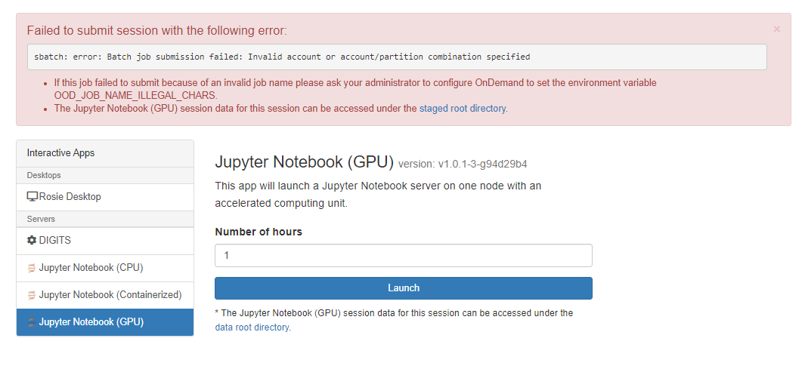

The cluster is only accessible on the campus network. If you are connecting from a building on campus, you are likely already attached to the campus network.

To access Rosie off campus, you must **first connect to the MSOE VPN**. Download a vpn client and log in with your campus credentials (@msoe.edu address).

## Vpn Clients

On **Windows** or **Mac**, you can download the GlobalProtect client from [vpn.msoe.edu](https://vpn.msoe.edu).

On **Linux**, a popular option is to use [openconnect](https://www.infradead.org/openconnect/index.html). Many distributions include openconnect with their default package manager. After you install openconnect, in your terminal execute: `sudo openconnect --protocol=gp vpn.msoe.edu`. 

## Your Rosie Cluster Account

EECS and ROSIE use a separate account management system than the campus network. To request an account, contact the EECS department or the ROSIE SysAdmin.

You will be given a username and a one time password (OTP). **Note: You must log in via shell to reset the OTP before you can use the web portal.**

[Account Activation Instructions](activate.md)

## Web Browser Access

Users can use their web browser to interact with Rosie. More information in the [Web Portal](web/dashboard.md) section of guide.

[Rosie Web Portal link](https://dh-ood.hpc.msoe.edu)

**Web Login Screenshot**


### New Account Login

When logging into Rosie for the first time (via the web portal), the system will ask you to create a home folder. Click the steps in sequence to start using the supercomputer.  

> [!Tip]
> Note that when you enter your password in a linux shell, it will not look like you are typing anything, so just enter your MSOE password carefully, and hit enter.

**New user greeting.**


**Web terminal opens in new tab. Type `yes` to continue.**


**SLURM Batch Job Submission Failed**

New users may not be able to launch an interactive app on the cluster. If you are running into this error, contact the System Administrator and ask to enroll as an authorized SLURM user able to request supercomputer resources.



## Shell Access

Users can directly connect to the management nodes and open a command line interface.

Connect with **ssh** to management node 2, 3, or 4.

```bash
    # connect to mgmt2
    $ ssh username@dh-mgmt2.hpc.msoe.edu

    # connect to mgmt3
    $ ssh username@dh-mgmt3.hpc.msoe.edu

    # connect to mgmt4
    $ ssh username@dh-mgmt4.hpc.msoe.edu
```

### SSH Terminal Program

**Windows** 

The Windows Operating System does not include ssh by default. There are a number of popular options.

* [PuTTY](https://www.putty.org/) is a classic cross-platofrm solution. Provides users with a ssh terminal login window capable of GUI support. [Getting Started Guide](https://the.earth.li/~sgtatham/putty/0.74/htmldoc/Chapter2.html#gs)
* Windows Subsystem for Linux [Guide](https://docs.microsoft.com/en-us/windows/wsl/install-win10). Brings a linux terminal program to the Windows OS.
* Download and install [GIT](https://git-scm.com/). The included git bash terminal program has a ssh command.

**Mac or Linux**

Your operating system includes this by default, yay! Launch terminal and issue `which ssh` to see the location of the ssh program binary file.


*More info about SSH available on the [OpenSSH homepage](https://openssh.com).*

### Connecting with PuTTY on Windows

1. Install the PuTTY program
2. Launch PuTTY, a PuTTY Configuration Dialog pops up
3. In the host name field input a managment node hostname, e.g. `dh-mgmt2.hpc.msoe.edu`
4. Click Open
5. Input your Rosie username and password.