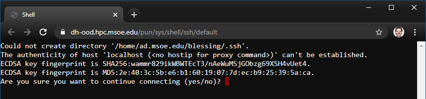

The cluster is only accessible on the campus network. If you are connecting from a building on campus, you are likely already attached to the campus network.

To access Rosie off campus, you must **first connect to the MSOE VPN**. Download a vpn client and log in with your campus credentials (@msoe.edu address).

## Vpn Clients

On **Windows** or **Mac**, you can download the GlobalProtect client from [vpn.msoe.edu](https://vpn.msoe.edu).

On **Linux**, a popular option is to use [openconnect](https://www.infradead.org/openconnect/index.html). Many distributions include openconnect with their default package manager. After you install openconnect, in your terminal execute: `sudo openconnect --protocol=gp vpn.msoe.edu`. 

## Your Cluster Account

The Rosie account management system is synchronized with the MSOE campus Active Directory system. You can access Rosie with your campus username and password.

* Rosie Username: `msoe_username@ad.msoe.edu`
* Rosie Password: `msoe_campus_password`

Where `msoe_username` is the first part of your campus email address. For example, the student John Smith has a MSOE email address `smithj@msoe.edu`, an MSOE username of `smithj`, and a Rosie login of `smithj@ad.msoe.edu`.

## Web Browser Access

Users can use their web browser to interact with Rosie. More information in the [Web Portal](web/dashboard.md) section of guide.

[Rosie Web Portal link](https://dh-ood.hpc.msoe.edu)

**Web Login Screenshot**


### New Account Login

When logging into Rosie for the first time (via the web portal), the system will ask you to create a home folder. Click the steps in sequence to start using the supercomputer.  Note that when you enter your password in a linux shell, it will not look like you are typing anything, so just enter your MSOE password carefully, and hit enter.  

**New user greeting.**.


**Web terminal opens in new tab. Type `yes` to continue.**.

> [!ATTENTION]
> The shell will prompt you for your password to log in. As a privacy feature, the shell will hide pressed keys from the screen. After typing in your password, press the enter key to submit.



## Shell Access

Users can directly connect to the management nodes and open a command line interface.

Connect with **ssh**.

```
    $ ssh "msoeusername@ad.msoe.edu"@dh-mgmt4.hpc.msoe.edu
```

### SSH Terminal Program

**Windows** 

The Windows Operating System does not include ssh by default. There are a number of popular options.

* [PuTTY](https://www.putty.org/) is a classic cross-platofrm solution. Provides users with a ssh terminal login window capable of GUI support. [Getting Started Guide](https://the.earth.li/~sgtatham/putty/0.74/htmldoc/Chapter2.html#gs)
* Windows Subsystem for Linux [Guide](https://docs.microsoft.com/en-us/windows/wsl/install-win10). Brings a linux terminal program to the Windows OS.
* Download and install [GIT](https://git-scm.com/). The included git bash terminal program has a ssh command.

**Mac or Linux**

Your operating system includes this by default, yay! Launch terminal and issue `which ssh` to see the location of the ssh program binary file.


*More info about SSH available on the [OpenSSH homepage](https://openssh.com).*


