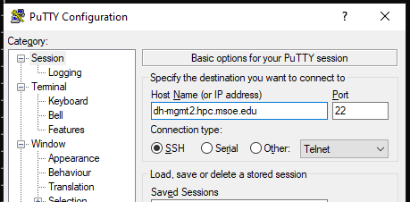
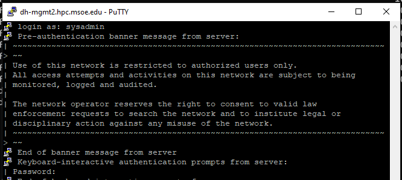

The cluster is only accessible on the campus network. If you are connecting from a building on campus, you are likely already attached to the campus network.

To access Rosie off campus, you must **first connect to the MSOE VPN**. Download a vpn client and log in with your campus credentials (@msoe.edu address).

## Vpn Clients

On **Windows** or **Mac**, you can download the GlobalProtect client from [vpn.msoe.edu](https://vpn.msoe.edu).

On **Linux**, a popular option is to use [openconnect](https://www.infradead.org/openconnect/index.html). Many distributions include openconnect with their default package manager. After you install openconnect, in your terminal execute: `sudo openconnect --protocol=gp vpn.msoe.edu`. 

## Your Rosie Cluster Account

With a recent Chance EECS and ROSIE use the same account management system than the campus network.
Because of this your ROSIE password should be the same as your MSOE password.

## Shell Access

Users can directly connect to the management nodes and open a command line interface.

Connect with **ssh** to management node 2, 3, or 4.

```bash
# connect to mgmt2
$ ssh username@ad.msoe.edu@dh-mgmt2.hpc.msoe.edu

# connect to mgmt3
$ ssh username@ad.msoe.edu@dh-mgmt3.hpc.msoe.edu

# connect to mgmt4
$ ssh username@ad.msoe.edu@dh-mgmt4.hpc.msoe.edu
```

### SSH Terminal Program

**Windows** 

The Windows Operating System does not include ssh by default. There are a number of popular options.

* [PuTTY](https://www.putty.org/) is a classic cross-platofrm solution. Provides users with a ssh terminal login window capable of GUI support. [Getting Started Guide](https://the.earth.li/~sgtatham/putty/0.74/htmldoc/Chapter2.html#gs)
* Windows Subsystem for Linux [Guide](https://docs.microsoft.com/en-us/windows/wsl/install-win10). Brings a linux terminal program to the Windows OS.
* Download and install [GIT](https://git-scm.com/). The included git bash terminal program has a ssh command.

**Mac or Linux**

Your operating system includes this by default, yay! Launch terminal and issue `which ssh` to see the location of the ssh program binary file.

Then enter the ssh connect commands above.

*More info about SSH available on the [OpenSSH homepage](https://openssh.com).*

### Connecting with PuTTY on Windows

1. Install the PuTTY program

2. Launch PuTTY, a PuTTY Configuration Dialog pops up

3. In the host name field input a managment node hostname, e.g. `dh-mgmt2.hpc.msoe.edu`



4. Click Open

5. Input your Rosie username and password.



## Web Browser Access

Users can use their web browser to interact with Rosie in a 
variety of ways. More information in the [Web Portal](web/dashboard.md) section of guide.

[Rosie Web Portal link](https://dh-ood.hpc.msoe.edu)

**Note:** Users must activate their account via Shell before being able to access the web terminal.

## Account Activation


1. Use **ssh** to connect to a head management node.
   
Launch your terminal program and input the command (replacing username with your own):

```shell
$ ssh username@ad.msoe.edu@dh-mgmt2.hpc.msoe.edu
```

2. The system will prompt for your one time password. Input this to proceed.

3. Re-enter your one time password to begin the password change process.

4. Input your desired password. It is critical to follow healthy password protocol here - the more complicated the more secure.

5. Verify your password by typing it in again.

After inputting your new password twice, the system will permit entry into the management node. You can now close this connecting or explore command line interface with the cluster. You can visit the web portal and login with your username and new password.