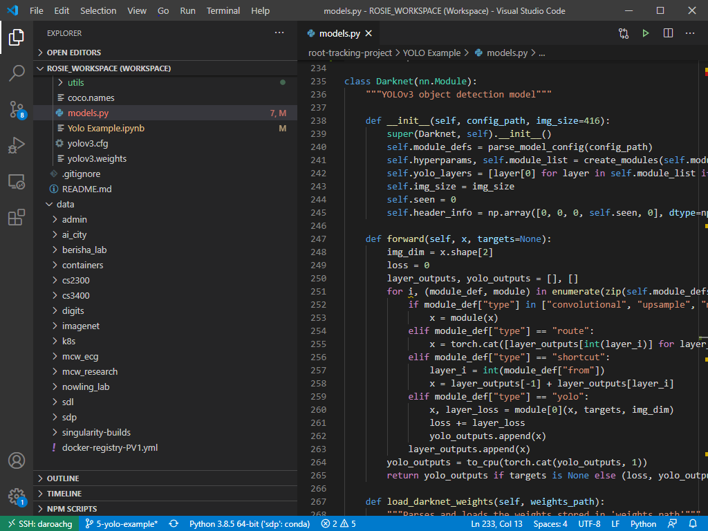
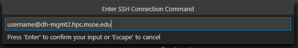

# VSCODE Remote Development Using SSH <!-- {docsify-ignore-all} -->

The Visual Studio Code Remote - SSH extension allows you to open a remote folder on any remote machine, virtual machine, or container with a running SSH server and take full advantage of VS Code's feature set. Once connected to a server, you can interact with files and folders anywhere on the remote filesystem.

No source code needs to be on your local machine to gain these benefits since the extension runs commands and other extensions directly on the remote machine.

## Install Instructions

Follow the official install documentation here: https://code.visualstudio.com/docs/remote/ssh.

To configure the Vscode remote ssh host, input your username and the second mgmt node as the hostname. e.g. `<username>@dh-mgmt2.hpc.msoe.edu`.

