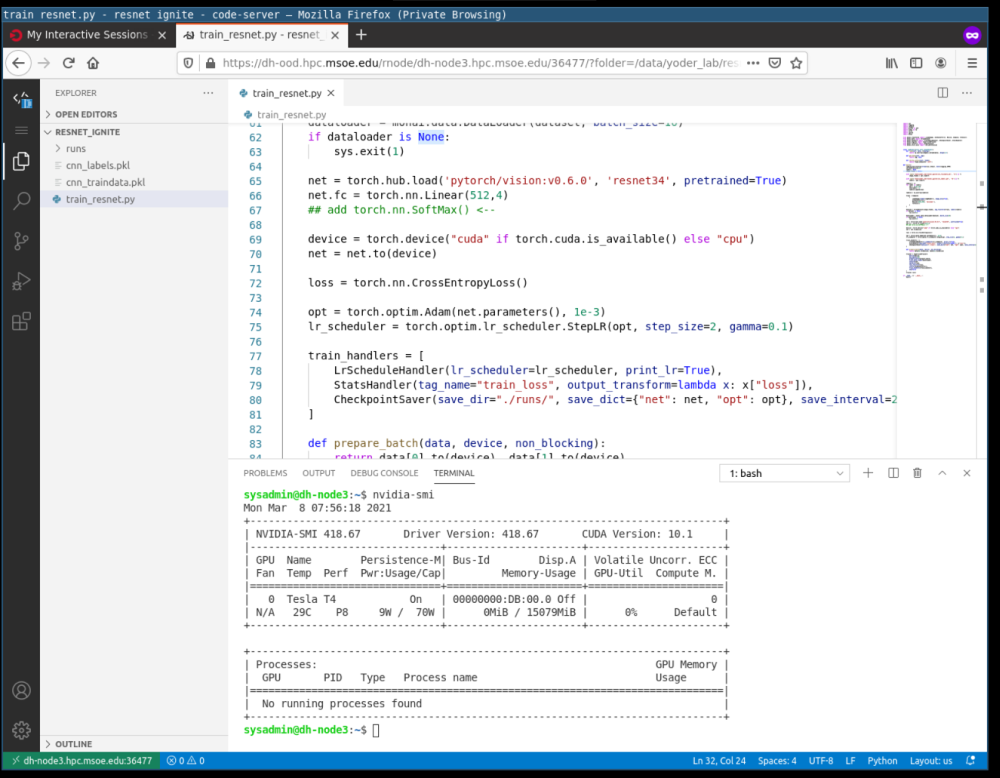
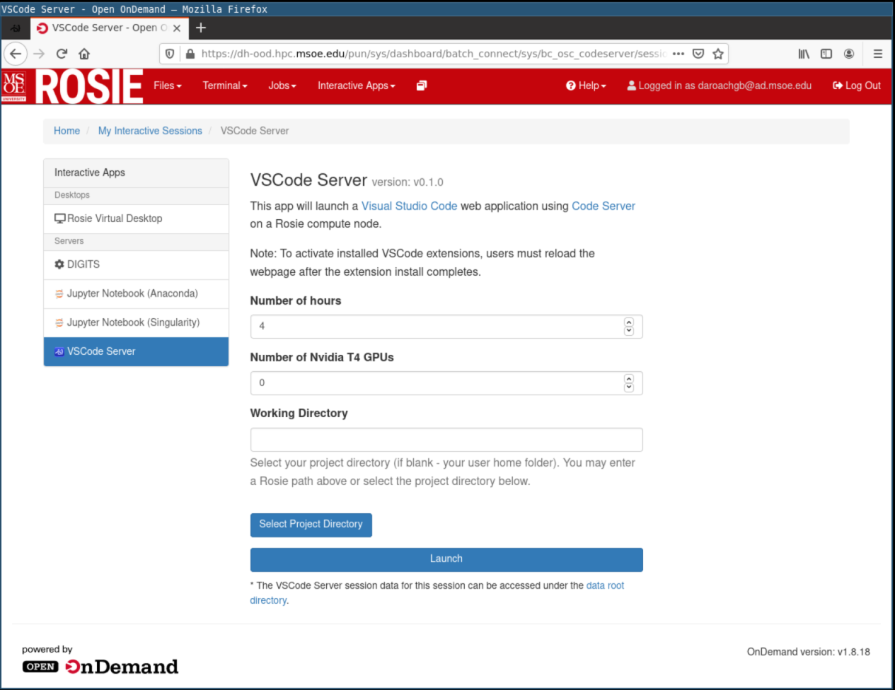
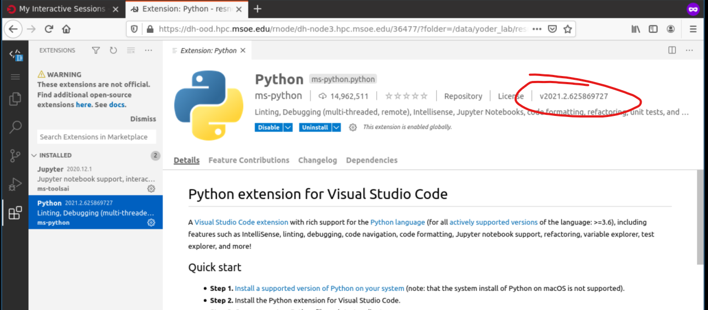
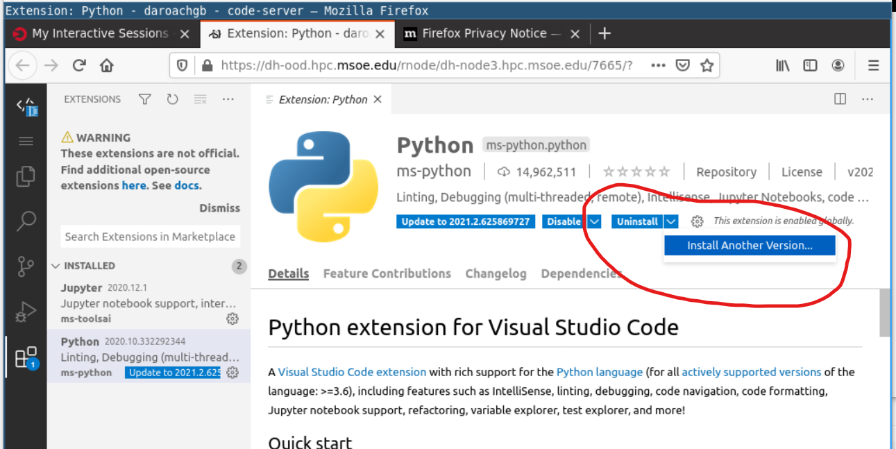
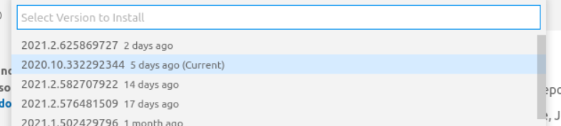

## VSCode Server

The interactive app is a full suite visual studio code server running on a compute node in the cluster. Users can install extensions, open multiple folders, debug processes, and launch terminals.

The launch code server page allows a user to select their starting working folder, number of t4 gpus, and a time to hold the resources.

## Python Debugging

To enable python debugging on Visual Studio code, install the ms-python package in the vscode extension bar.

**Note:** There is a bug with the most recent version of python vscode extension - `v2021.x` To enable python debuging, you must install a previous verious of the extension. You can do this with the dropdown menu next to uninstall. Select the most recent `2020.x` version of the python extension.

**Check for invalid version**

**Under uninstall dropdown menu, select Install Another Version**

**In the popup menu, select the working previous version**

