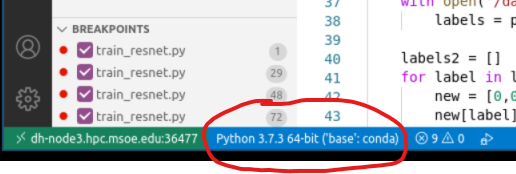
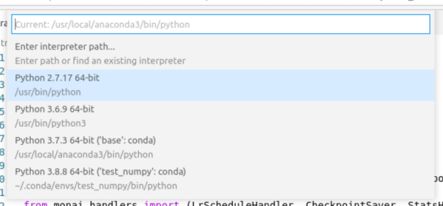
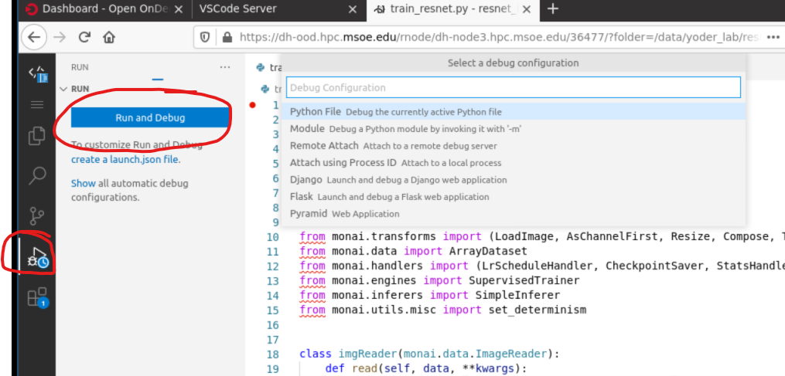
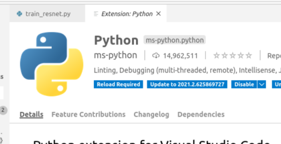

The interactive app is a full suite visual studio code server running on a compute node in the cluster. Users can create and edit projects, install extensions from the large vscode community, open multiple folders, debug processes, launch terminals, and more.

**Interactive App Screenshot**

**Launching the App**

The launch code server page allows a user to select their starting working folder, number of t4 gpus, and a time to hold the resources.

## Python

To enable VSCode's python language features, install the ms-python package in the vscode extension bar.

**Note: There is a bug with the latest python extension. See the Installing Extension subsection below to install a previous version.**

### Selecting Conda Environment

VSCode's Python extension allows you to select between user managed conda environments. To change the current working environment, select the Python label in the bottom task bar. Then in the popup window, choose the interpreter you wish to use.

### Running Debugger

The screenshot below exemplifies running the debugger on the current python file.

### Installing Extension

To install the python extension, select the extension button in the sidebar and search for python.

**Note:** There is a bug with the most recent version of python vscode extension - `v2021.x` To enable python debugging, you must install a previous verious of the extension. You can do this with the dropdown menu next to uninstall. Select the most recent `2020.x` version of the python extension.

**Check for invalid version**

**Under uninstall dropdown menu, select Install Another Version**

**In the popup menu, select the working previous version**

**Then reload the VSCode Server**

## Keyboard Shortcuts

VSCode has a number of helpful keyboard shortcuts to help with development.

To open the terminal, `ctrl+~`.

To open the file search bar, `ctrl+p`.

To open the command search bar, input `>` into the file search bar. From here, you can search for any command and see its keyboard shortcut. For example, search for `>move` to see the move line commands.