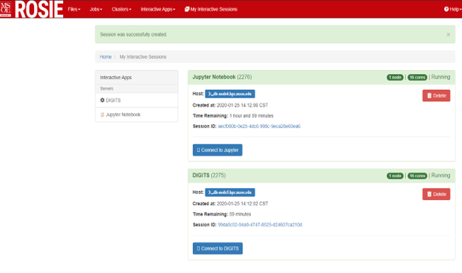

Users can use their web browser to interact with the computer cluster and schedule jobs.

On the web portal you can

* Open a Jupyter notebook instance for as many hours as needed.
* Ssh into the machine running the server and execute shell commands.
* Train neural networks for long periods of time.
* Install any python packages you need.

**VPN Note:** The cluster is only accessible within the MSOE campus network. If you are off campus, you must connect to the MSOE virtual private network. See [Network Access](../access.md) for additional details.

[ROSIE Web Portal link](https://dh-ood.hpc.msoe.edu)

**Interactive Apps**

