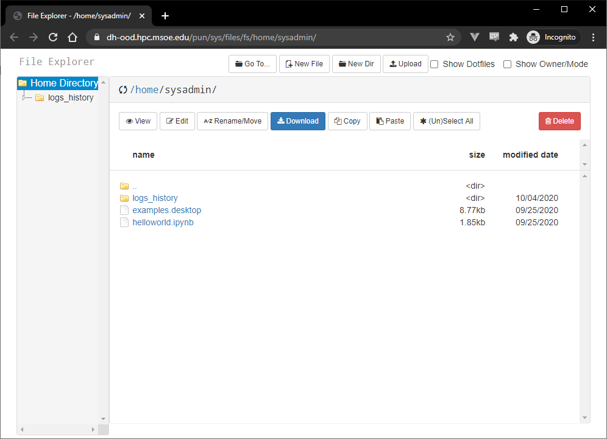
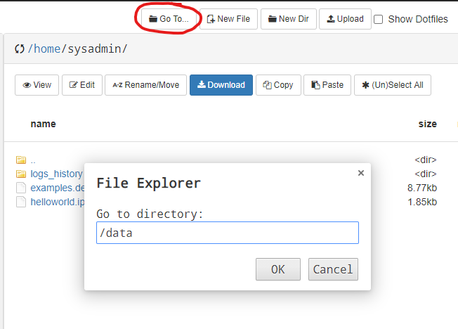

The ROSIE OpenOnDemand features a web file browser where you can edit, rename, copy, move, and more to your files and folders.

**Web File Explorer**

**Launching File Explorer**

You can access the file explorer app in the web dashboard navigation bar.

**GoTo Files button**

The goto files button lets you jump to a different folder, for example the `/data` shared pool.

**About**

[FileExplorer App Github Repo](https://github.com/OSC/ondemand/tree/master/apps/files)

The Ohio Supercomputer Center maintains the file app program. You can see and contribute to the source on github.