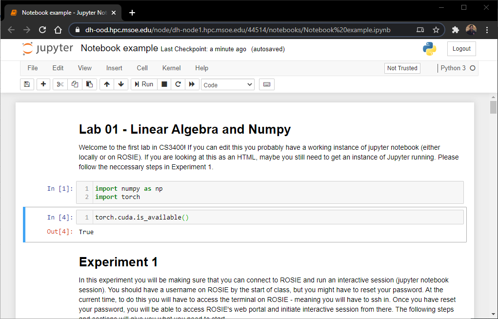
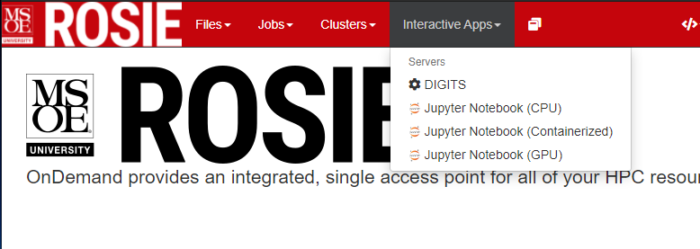

Log into the [ROSIE Web Portal](http://dh-ood.hpc.msoe.edu) with your ROSIE username and password. Click on the Interactive Apps dropdown menu in the toolbar. From here you can launch a jupyter notebook web server for some amount of user specified time.

**Note:** The shell access button will launch a terminal right in your browser. You can view and manage files on the node during the allocated time.

## Launching Jupyter Notebook Server

To launch the server, click the interactive apps dropdown button on the web portal navigation bar.

You can then choose the server type and launch options.

## Server Types

| Name                    | Description                             |
|-------------------------|-----------------------------------|
| Jupyter (Anaconda)           | User base conda environment.     |
| Jupyter (Singularity)        | Containerized python environment with accelerated computing hardware. Use for exploring managed library environments. |

## Jupyter (Anaconda)

This runs in the base user conda environment.

**Feature Request** Working on enabling users to select other environments here.

## Jupyter (Singularity)

Runs the jupyter notebook server with the users base conda environment.

### Adding Python Packages To Singularity Images

You can install python packages inside of the jupyter notebook servers.

The container's system directory is read-only. You can install a python package in userspace with the `--user` flag.

`!pip install <packagename> --user`.

**Example installation in containerized ipynb server**

## Accessing data

The jupyter notebook server will have access to your home directory at `/home/username`. Additionally, the cluster datapool will be mounted at `/data`. You can read/write files from the datapool with your scripts. An easy way to access the data pool is to create a symbolic link in your home folder. See `$ man ln` for info on creating the link.